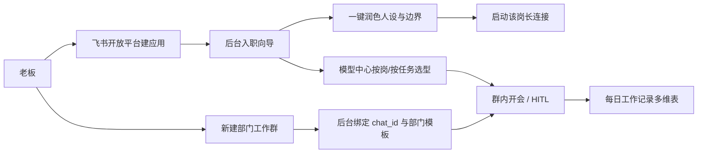
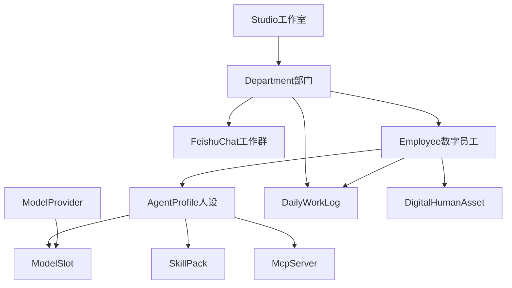

# MatrixSolo 后续升级 PRD

| 项 | 内容 |
| --- | --- |
| 文档类型 | 产品需求文档（后续升级） |
| 产品 | MatrixSolo 一人影视自媒体多 Agent 协作中台 |
| 版本 | v1.0 |
| 日期 | 2026-09-02 |
| 状态 | 待排期 |
| 基线文档 | [MatrixSolo.md](./MatrixSolo.md)（当前产品规格，本文不替代） |
| 读者 | 老板 / 产品 / 研发 / 运营配置人员 |

---

## 1. 文档说明

### 1.1 与基线 PRD 的关系

[MatrixSolo.md](./MatrixSolo.md) 描述的是**已经落地的一人五岗工作室**：飞书 HITL、LangGraph 生产 DAG、群内 huddle、Next.js 管理台、Grsai 文本 + 生图。本文只写**后续要升级的九件事**，不重写已上线能力。

两份文档冲突时：以本文「目标态」为准做新功能；以 MatrixSolo.md 为准理解现网行为，直到对应模块在本文验收通过。

### 1.2 升级命题（老板原话）

1. 支持更多 LLM 的添加和改变
2. 探寻更多 Skill 和 MCP
3. 数字人 / 数字员工方向
4. 后台系统界面改善
5. 联动多维表格做每日工作项目记录
6. 建新工作群，以群为部门（头条图文部、视频抖音部、视频哔哩哔哩部等）
7. 优化升级后台身份编辑以及系统提示词的框架结构，使其更专业
8. 支持添加新员工（飞书开放平台先手动建智能体并命名；后台入职；一键润色生成身份边界和系统提示词）
9. 后续接入语言大模型、多模态大模型、视频大模型

### 1.3 产品愿景（升级后）

MatrixSolo 从「固定五岗、单群、单一文本模型」升级为：

**可配置的数字影视工作室操作系统** —— 老板在飞书里按部门开会，在后台里招人、换模型、装技能、看每日台账；关键决策仍走 HITL，执行层可接到更多文本 / 图像 / 视频模型与 MCP 工具。

### 1.4 设计原则

- **飞书是工位，后台是人事与基建。** 日常指挥继续在群里；招人、换模型、改人设、绑部门在 Admin。
- **人先建飞书应用，系统再入职。** 不自动调开放平台创建应用，避免权限与审核不可控。
- **部门 = 工作群。** 一个飞书群对应一个内容部门，隔离记忆、日历、HITL 与默认管线。
- **提示词是可版本化的操作系统，不是一段 textarea。** 工作室守则 / 部门 SOP / 岗位人设 / 任务契约分层拼装。
- **模型按能力槽位接入，不绑死某一家。** 文本、视觉理解、生图、视频、TTS 分开注册。
- **可执行工具与提示词包分开。** Skill.md 可以只教怎么说话；真正调 API 的走 Runtime / MCP，并有超时与审计。

### 1.5 非目标（本文明确不做）

- 不自动在飞书开放平台创建应用、不代填审核资料。
- 不在本期交付完整「数字人实时驱动 / 口型同步渲染农场」（只做方向、资产登记与接口预留）。
- 不承诺绑定某一家视频大模型（Sora / Veo / Kling / Runway 等为待决策）。
- 不把后台从 Next.js 换成新框架。
- 不把一人工作室做成对外 SaaS 多租户计费系统。
- 不删除现有五岗与现有生产 DAG；新员工默认是「可入职的同事」，是否进入 huddle 由部门模板决定。

---

## 2. 成功指标

| 指标 | 基线（现在） | 目标 |
| --- | --- | --- |
| 可配置 LLM Provider | 代码内写死 4 家 | 后台可新增任意 OpenAI 兼容源，并给岗位切换，无需改代码发版 |
| 岗位数量 | 硬编码 5 | 后台入职第 6 岗后，该岗能进指定群、被 @、配模型/Skill |
| 工作群 / 部门 | 1 个 HITL 群，无部门实体 | ≥3 个部门群并行，记忆与日历不串台 |
| 每日工作记录 | 无独立产品实体 | huddle / HITL / 工作流状态变更自动落多维表，后台可按日筛选 |
| 人设专业度 | 六段字段 + 只读拼接预览 | Prompt OS 分层、可预览拼装顺序、可回滚、一键润色 |
| Skill / MCP | 提示词包为主，MCP stdio 未真正拉起 | 至少 1 条可执行 Skill 闭环 + 1 条 stdio/HTTP MCP 工具能被模型调用 |
| 多模态 | 文本 chat + 独立 gpt-image-2；视频 = ffmpeg 静帧+TTS | Gateway 具备 text/vision/image/video/tts 槽位；视频生成可配置但不强制上线 |

---

## 3. 当前能力基线（对照实现）

以下是 2026-09 现网事实，作为升级对照，不是未来规格。

### 3.1 组织与飞书

- 固定五岗：`strategy / script / visual / editor / ops`（总编沈策、文案林钩、视觉顾帧、剪辑阿刀、运营周航）。
- 凭证只在 `.env`：`FEISHU_{STRATEGY\|SCRIPT\|VISUAL\|EDITOR\|OPS}_APP_ID/SECRET`，外加兜底 `FEISHU_APP_ID/SECRET`。
- HITL 只投一个群：`FEISHU_HITL_CHAT_ID`。
- 群消息可在机器人所在的任意群回复，但**没有部门、没有 chat_id 映射、共享记忆全局一份**（`data/admin/studio_huddle.json`）。
- 员工配置展示在 Admin 总览，**不能在后台新增岗或填写 app_id**。
- 关键代码：[src/matrixsolo/feishu/staff.py](src/matrixsolo/feishu/staff.py)、[src/matrixsolo/feishu/chat.py](src/matrixsolo/feishu/chat.py)、[src/matrixsolo/config.py](src/matrixsolo/config.py)。

### 3.2 编排

- 生产 DAG：`strategy → topic HITL → script → script HITL → visual/audio → render → final HITL → ops`（[src/matrixsolo/orchestration/graph.py](src/matrixsolo/orchestration/graph.py)）。
- 群 huddle：无 @ / 多 @ / 「开工」类口令 → 五岗串行开会；job 类型 `logo | poster | talk`（[src/matrixsolo/orchestration/huddle.py](src/matrixsolo/orchestration/huddle.py)）。
- HITL 卡片回传：`card.action.trigger` 需立刻 toast，后台再 `resume_hitl`（飞书 200671 已按此修）。

### 3.3 LLM

- 网关已支持 `openai / anthropic / deepseek / grsai`，每岗 `LLMConfig`，`TaskKind`（creative / structured / classify / guardrail）有降级路由。
- 实战五岗几乎全是 **Grsai `gpt-5.4`**；消息体是 `list[dict[str, str]]`，**无图像/视频输入**。
- 生图走独立 API：`gpt-image-2`（[src/matrixsolo/skills/runtime.py](src/matrixsolo/skills/runtime.py)）。
- 视频成品：ffmpeg 静帧封面 + Edge TTS，不是视频大模型。

### 3.4 Skills 与 MCP

- 内置工具目录 `TOOL_CATALOG`：`web_fetch / browser_crawl / hot_radar / image_gen / tts / mcp_edit / bitable …`；真正在 `SkillRuntime.run` 里执行的主要是热榜、抓取、生图。
- 安装的 `SKILL.md` 大多当**提示词注入**，不执行包内脚本。
- MCP：每岗可配 http/sse/stdio；`RoleMcpRuntime` 对 stdio 是占位；本地 `matrixsolo-mcp`（8765）提供 `auto_edit / transcode / scene_detect / md5`，部分为 stub。
- 编排里 `enrich_with_mcp_context` 目前主要是**打日志列出工具**，不是模型自动 tool-call。

### 3.5 管理台

- Next.js `:3434`，三页：系统总览、工作流看板、岗位 Agent。
- 岗位编辑六 Tab：人设与边界、系统提示词、LLM、内置技能、技能包、MCP。失焦即 PUT 保存。
- `composed_system_prompt` 只读预览：活人感守则 → 工作室共识 → 身份/性格/职业/风格/记忆/边界 → 任务契约 → 工具/Skills/MCP。
- **无新建员工、无部门、无模型中心、无工作记录页。**

### 3.6 多维表格

已配置槽位，但没有「每日工作项目记录」：

| 环境变量 | 用途（现状） |
| --- | --- |
| `FEISHU_BITABLE_APP_TOKEN` | 多维表格 App |
| `FEISHU_TABLE_CONTENT_CALENDAR` | 内容日历行（选题/档期） |
| `FEISHU_TABLE_TASKS` | 工作流任务 upsert（workflow_id / status / film / title） |
| `FEISHU_TABLE_ASSETS` | 预留 |
| `FEISHU_TABLE_METRICS` | 预留 |

本地另有 `data/admin/content_calendar.jsonl`。后台 `/workflows` 看本地日历，不是直播飞书表。

---

## 4. 目标用户与核心场景

| 角色 | 诉求 |
| --- | --- |
| 老板（MatrixSoloCEO） | 在不同部门群指挥；审批选题/脚本/成片；看每天谁干了什么 |
| 配置员（可与老板同一人） | 换模型、装 Skill、招新数字员工、改人设，不改 Python |
| 数字员工 | 清楚自己属于哪个部门、能做什么、越界找谁、用哪套模型与工具 |
| 研发 | 有稳定的员工注册表、模型能力槽位、部门作用域，避免每加一岗改枚举 |

### 4.1 主路径（升级后）

---

## 5. 目标信息架构

管理台从三页扩为工作室操作系统（仍用现有 Next.js Admin，不换框架）：

| 导航 | 职责 |
| --- | --- |
| 系统总览 | 健康、飞书连接、今日工作摘要、告警 |
| 部门与群 | 部门 CRUD、绑定飞书 `chat_id`、默认岗组合与 HITL 策略 |
| 员工 | 名册、入职、停用、所属部门、飞书 app 状态 |
| 岗位编辑 | Prompt OS、模型、Skill、MCP、数字人资产（从员工名册进入） |
| 模型中心 | Provider / 模型 / 能力槽位 / 全局与按岗覆盖 |
| Skill 与 MCP | 市场、安装、可执行探测、审计 |
| 工作记录 | 按日/部门/员工筛选；跳转飞书多维表 |
| 工作流看板 | 现有 huddle 快照、DAG、本地日历、入站追踪 |

飞书侧：每个部门一个工作群；机器人按部门模板拉入；HITL 卡片打到该群，不再写死单一 `FEISHU_HITL_CHAT_ID`（该环境变量降级为「默认部门」）。

---

## 6. 跨模块领域模型

升级后的核心对象（逻辑模型，落盘可以是 JSON + 飞书表，P2 后再考虑独立 DB）：

关键约束：

- `Employee.id` 稳定字符串（如 `strategy`、`headline_editor`），**不再要求属于 `AgentRole` 五值枚举**。
- 一个员工可属多个部门；一个部门有一份 `pipeline_template`（图文可不跑剪辑）。
- `chat_id → department_id` 必须唯一；一个群不能同时当两个部门。
- 密钥（LLM、飞书 app_secret）只存服务端，Admin API 返回脱敏。

建议新持久化（P0 起逐步加，不一次打爆）：

| 文件 / 表 | 内容 |
| --- | --- |
| `data/admin/model_providers.json` | 自定义 Provider |
| `data/admin/employees.json` | 动态员工注册表（含飞书 app 引用） |
| `data/admin/departments.json` | 部门与 chat_id、模板 |
| `data/admin/prompt_versions/{employee_id}.jsonl` | Prompt 版本 |
| `data/admin/work_logs.jsonl` | 每日工作记录本地镜像 |
| `FEISHU_TABLE_WORK_LOGS` | 飞书多维表正式台账 |
| `data/admin/digital_humans.json` | 数字人资产登记 |

现有 `agent_profiles.json` 在过渡期继续作为 profile 正文；员工注册表指向 `role/id`。

---

## 7. 模块 1 — 更多 LLM 的添加与改变

### 7.1 问题

目录写死四家；换一个 OpenAI 兼容中转或新模型名要改代码。按岗虽能填 `base_url`，但没有「模型中心」、没有连通性探测、没有按任务类型的可视化覆盖。密钥与模型能力（会不会看图、会不会出视频）未建模。

### 7.2 用户故事

- 作为配置员，我要在后台新增一家「某某中转」，填 Base URL 和 Key，测通后把总编切过去，文案仍用 Grsai。
- 作为配置员，我要把「创意任务」和「审核/JSON 任务」拆到不同模型，而不改 Python。
- 作为研发，Gateway 必须按 `capability` 拒绝把视频请求打到纯文本模型。

### 7.3 功能规格

**模型中心（Admin 新页）**

- 内置 Provider 只读展示：Grsai / OpenAI / Anthropic / DeepSeek（与现 `LLM_PROVIDER_CATALOG` 一致）。
- **自定义 Provider**：`id`、显示名、`base_url`、鉴权方式（Bearer / Anthropic-x-api-key / 自定义头）、默认超时。
- **模型条目**：`model_id`、显示名、`capability[]`：`text | vision | image | video | tts`、上下文长度备注、单价备注（可选，纯展示）。
- **探测**：发一条最小 chat/completions（或对应 modality 探测），展示延迟与错误原文。
- **路由策略**：
  1. 岗位覆盖（现有 `AgentProfile.llm`）
  2. 任务类型覆盖（`TaskKind` → provider+model）
  3. 全局默认（现 `LLM_DEFAULT_PROVIDER`）
  4. 健康降级链（现网已有，需在 UI 展示顺序）
- 密钥：写入只在服务端；GET 返回 `sk-****abcd`；支持「未改密钥则不覆盖」。

**Gateway 改造要点（实现阶段）**

- 从 `Literal["openai","anthropic","deepseek","grsai"]` 放宽为注册表 id。
- 自定义源默认走 OpenAI 兼容 `/chat/completions`；Anthropic 类走 `/v1/messages`。
- `chat_for_role` 继续注入 `composed_system_prompt`；新增 `chat_for_employee(employee_id)` 作为别名。

### 7.4 验收

- 不改代码：后台加一个自定义兼容源，总编改用该源后，群里 @总编 走新模型（日志可核对 model 名）。
- 填错 Key 时探测失败，岗位保存被拦截或显著告警，不静默 mock（生产环境关闭无 Key mock，或明确开关）。
- 前端看不到完整密钥。

### 7.5 依赖与风险

- 部分中转不支持 Anthropic 协议，UI 必须标明 protocol。
- 飞书卡片 3 秒超时与模型慢是两件事：HITL/长任务必须后台跑（现网卡片回传已按此做）。

---

## 8. 模块 2 — 探寻更多 Skill 与 MCP

### 8.1 问题

目录里很多工具只是开关文案；安装的 Skill 不执行；MCP stdio 未拉起；模型看不到「当前能调哪些函数」。探寻更多技能的前提是**可发现、可执行、可审计**，否则装再多 SKILL.md 也只是加长系统提示词。

### 8.2 用户故事

- 作为视觉岗，我安装一个生图 Skill 后，模型应调用 Runtime 真出图，而不是把 `generate.py` 当小说读。
- 作为剪辑岗，我配置一个本地 stdio MCP，后台能列出 tools，huddle/DAG 里能真正 `tools/call`。
- 作为老板，我能在审计里看到谁、何时、调了哪个工具、成功还是超时。

### 8.3 功能规格

**Skill 分层**

| 类型 | 含义 | 例子 |
| --- | --- | --- |
| `prompt` | 只注入人设/SOP | 平台标题规范、禁用词表 |
| `runtime` | `SkillRuntime` 已实现 | `image_gen`、`hot_radar`、`web_fetch` |
| `mcp` | 转到某 MCP server 的 tool | `auto_edit` |
| `http` | 受控 HTTP 调用（白名单 host） | 内部素材库 |

- Skill 市场：内置推荐目录（与影视生产相关：热榜、封面、字幕、合规、日历）+ 现有 URL / 上传 / 飞书安装。
- 安装时解析 `SKILL.md` frontmatter：`name / description / type / allowed_tools / mcp_server`。
- 聊天与 huddle：模型输出结构化 tool call（JSON 或 provider native tools），Runtime 执行后把结果再喂回模型，**限制循环次数**（建议 ≤3）。

**MCP**

- 补齐 stdio：按 `command + args + env` 拉起进程，JSON-RPC `tools/list` / `tools/call`。
- SSE/HTTP 保持现有探测；失败显示 unreachable，不阻断岗位保存。
- 每岗「MCP 工具」面板：名称、描述、一键试调用（只读工具默认允许，写操作需确认）。
- 安全：单次超时（默认 30s，渲染类 300s）、输出体积上限、host 白名单、禁止把 app_secret 传入工具参数。

**与现网目录的关系**

优先把已在 `TOOL_CATALOG` 但未闭环的项做成真能力，而不是先堆新名字：`rag`、`safety`、`subtitle`、`distribute`、`mcp_tools`。新 Skill 探索放在市场「实验」分区。

### 8.4 验收

- 视觉岗启用 `image_gen`，huddle 海报任务飞书出现图片，不出现本地路径 Markdown。
- 为一个测试 MCP 注册 stdio，Admin 能列出 ≥1 个 tool，试调用返回非 stub 或明确的 stub 标记。
- `data/admin/tool_audit.jsonl`（或等价）能查到本次调用。

### 8.5 风险

- 不可信 SKILL.md 可能诱导越权：执行类必须白名单，prompt 类只注入文本。
- Windows 下 stdio 子进程与现有飞书 WS 子进程一样要可回收，避免孤儿进程。

---

## 9. 模块 3 — 数字人 / 数字员工方向

数字人与数字员工在本文**拆成两层**，避免和第 8 模块抢定义。

| 层 | 含义 | 主模块 |
| --- | --- | --- |
| 组织层 | 飞书里的数字同事（应用、花名、部门、权限） | 模块 6、8 |
| 形象层 | 出镜用的声线、形象、口播驱动 | 本模块 |

### 9.1 问题

现岗已有花名与口吻，但没有「这人长什么样、用哪条声线、能否出镜」。后续短视频部门会需要数字人口播，不能等到视频模型来了再找数据模型。

### 9.2 一期范围（P3 才做深，P0 只预留字段）

**P0 预留（员工档案可空）**

- `avatar_name`、`voice_id`（Edge/Azure 或后续克隆 id）、`portrait_asset_id`、`enabled: false`。

**P3 目标**

- 员工绑定：音色、半身/形象参考图、默认口播模板（开场 3 秒、字幕样式）。
- 生产：脚本岗出稿 → TTS →（可选）视频模型或数字人口播服务 → 剪辑岗收成片。
- 飞书：视觉/剪辑发送「形象预览图」或短样片，HITL 终审仍走现卡。

**明确延后**

- 实时驱动、直播数字人、手机端捏脸编辑器、商用版权形象市场。

### 9.3 验收（P3）

- 运营或剪辑岗能在档案里选一条声线，最小口播样片与现 ffmpeg 静帧链路二选一可配置。
- 未启用数字人时，现网静帧+TTS 行为不变。

### 9.4 待决策

- 数字人口播供应商（自研 / 腾讯智影 / 剪映 / HeyGen 等）：**未定**。
- 形象版权与肖像合规由老板提供素材，系统不爬取真人。

---

## 10. 模块 4 — 后台系统界面改善

### 10.1 问题

三页导航撑不住「模型、部门、入职、台账」。岗位页六个 Tab 平行，人设与「最终拼出来的系统提示词」割裂；失焦即保存没有未保存态；总览信息密度不够（连接状态、今日产出）。

### 10.2 用户故事

- 作为配置员，我打开后台就知道：哪些机器人在线、今天各部门干了几条、哪张 HITL 还没点。
- 作为配置员，我改身份时左边是分层字段，右边是实时组合预览，保存前能对比 diff。
- 作为配置员，我从「员工」进编辑，而不是在三个地方找同一岗。

### 10.3 功能规格

**导航与布局**

- 侧栏按第 5 节信息架构扩展；当前「岗位 Agent」升级为「员工」入口。
- 总览增加：WS 子进程存活、模型默认、今日工作记录条数、阻塞中的 HITL 列表（读 workflow store）。
- 工作流看板保留，增加「按部门筛选」（P2 部门落地后）。

**岗位/员工编辑**

- 分栏：左编辑 / 右 `composed_system_prompt` 预览（按 Prompt OS 小标题着色）。
- 显式「保存」+ 离开未保存警告；可保留失焦自动保存，但必须有 dirty 指示。
- 顶部元信息：花名、飞书 app_id 脱敏、所属部门、启用开关、一键润色入口（模块 8）。

**体验约束**

- 不新引入 UI 框架；沿用现有字体与暗色工坊气质。
- 所有写操作失败要 toast 原因，禁止只 `console.error`。
- 关键路径（入职、绑群、测模型）用向导，不要十个字段一屏丢给用户。

### 10.4 验收

- 新导航可达所有 P0 页面；旧书签 `/agents/{role}` 仍可用（redirect 或保留）。
- 修改身份后预览与实际 `chat_for_role` 注入文本一致（可用「复制完整提示词」核对）。
- 未保存离开有确认（或自动保存成功有明确「已同步」）。

---

## 11. 模块 5 — 联动多维表格做每日工作项目记录

### 11.1 问题

日历表记的是「打算发什么」，任务表记的是「某条 workflow 状态」，都不是老板要的「今天工作室干了哪些项目」。huddle、HITL、失败重试在飞书里刷屏，事后无法按日复盘。

### 11.2 用户故事

- 作为老板，我打开飞书多维表就能看到：今天头条图文部做了哪条选题、谁过了 HITL、产出链接在哪。
- 作为老板，我在后台按日期/部门筛选同一份数据，不必翻群记录。

### 11.3 功能规格

**新表：每日工作记录**

环境变量：`FEISHU_TABLE_WORK_LOGS`（附录字段名需与飞书列一致，可在 Admin「字段映射」里改中文列名）。

| 字段 key | 类型 | 说明 |
| --- | --- | --- |
| `log_id` | 文本 | 幂等主键 |
| `date` | 日期 | 业务日（默认 Asia/Shanghai） |
| `department_id` / `department_name` | 文本 | P2 前可空或填 `default` |
| `employee_id` / `employee_title` | 文本 | 主责岗 |
| `project` | 文本 | 片名/选题/「公司 logo」等 |
| `work_type` | 单选 | huddle / hitl / workflow / manual |
| `status` | 单选 | started / blocked / done / failed |
| `summary` | 文本 | 一句话结果 |
| `artifact_url` | 文本 | 飞书消息/图片/预览文件 |
| `workflow_id` | 文本 | 可空 |
| `chat_id` | 文本 | 来源群 |
| `extra` | 文本 | JSON 备注 |

**写入时机（自动）**

1. huddle 结束（成功或失败都写，失败 `status=failed`）。
2. HITL 通过 / 换一批 / 终审调度（记谁点的按钮、推进到哪一阶段）。
3. 生产 DAG 状态变更到 `COMPLETED` / `CANCELLED` / 阻塞。
4. 后台「补记」手动一行。

**幂等**：`log_id` 建议 `sha1(date + workflow_id + work_type + stage)`，重复事件更新而非狂插。

**双写**：飞书表为主展示；本地 `work_logs.jsonl` 为后台筛查与断网兜底。飞书未配置时只写本地，总览黄条提示。

**后台「工作记录」页**

- 筛选：日期范围、部门、员工、状态。
- 行点击跳转 workflow 详情或飞书消息（若有）。
- 「打开飞书表」外链（App token + 表）。

### 11.4 验收

- 跑一次群内 huddle 后，本地与（若已配表）飞书各出现一行，字段齐全。
- 同一 HITL 连点不产生 10 条重复「通过选题」（更新同一 `log_id`）。
- 未配 `FEISHU_TABLE_WORK_LOGS` 时产品不崩溃，仅本地可查。

### 11.5 与现表分工

| 表 | 继续做什么 | 不做什么 |
| --- | --- | --- |
| CONTENT_CALENDAR | 档期、槽位、平台 | 不替代每日流水 |
| TASKS | 单条生产 DAG 生命周期 | 不记 huddle 闲聊级会议 |
| WORK_LOGS | 每日项目流水与复盘 | 不存成片二进制 |

---

## 12. 模块 6 — 新工作群与部门视角

### 12.1 问题

一人公司已经按平台拆内容（头条图文、抖音短视频、B 站长视频），但系统仍是「一个工作室群 + 五岗 convene」。图文部不该被强制走剪辑 HITL；B 站部的记忆不该被抖音部海报冲掉。

### 12.2 用户故事

- 作为老板，我新建「头条图文部」群，拉总编/文案/视觉/运营（可不拉剪辑），在后台把该群绑成部门。
- 作为老板，我在图文群说「开工」，只跑该部门模板的岗，写到该部门日历与工作记录。
- 作为老板，我在抖音部点 HITL，卡片只出现在抖音部群。

### 12.3 功能规格

**部门实体**

- 预置模板（可改名、可复制）：
  - 头条图文部：`strategy, script, visual, ops`；job 偏图文/封面；默认不跑 editor 成片。
  - 视频抖音部：五岗全开；短解说 / 混剪。
  - 视频哔哩哔哩部：五岗全开；更长脚本与终审。
- 字段：`name`、`platform`（toutiao / douyin / bilibili / other）、`chat_id`、`hitl_chat_id`（默认同 `chat_id`）、`member_employee_ids[]`、`pipeline_template`、`enabled`。

**飞书侧人工步骤（产品文案必须写在入职/绑群向导里）**

1. 建群、命名为部门名。
2. 将该部门需要的机器人拉进群。
3. 在群里发任意消息或从飞书复制 chat_id（后台提供「从最近入站消息选择群」降低门槛）。
4. 后台保存绑定。

**隔离**

- `studio_huddle`、日历行、工作记录、workflow 均带 `department_id`。
- 入站消息先 `chat_id → department`，再选员工与模板；未绑定的群：走默认部门或回复「先在后台绑定部门」。
- `@单岗` 仍 1:1，不强制 huddle；无 @ 且命中开工口令 → **本部门 huddle**，不是全球五岗。

**编排**

- huddle 图按部门成员裁剪节点（缺 visual 则跳过生图）。
- 生产 DAG 可按模板跳过 render（图文部出封面+文案即 HITL 终态待定：P2 需定义图文终审是否仍用「成片」卡，建议新增 `copy_pack` 终审，避免假视频）。

### 12.4 验收

- 两个部门群同时开工，记忆与工作记录不串。
- 图文部模板不启动剪辑 WS 也可以完成「选题+文案+封面」huddle（若成员不含 editor）。
- 旧 `FEISHU_HITL_CHAT_ID` 在未建部门时仍作为 default 部门，现网行为兼容。

### 12.5 风险

- 飞书每个机器人都要进群，部门变多后拉人烦琐：向导给清单「本部门应拉哪些 app」。
- 同一机器人进多个部门群是允许的（员工多部门）；路由只看消息所在 `chat_id`。

---

## 13. 模块 7 — 身份编辑与系统提示词框架（Prompt OS）

### 13.1 问题

现有六段已经比「一个系统提示词」专业，但：

- 工作室守则 `STUDIO_VOICE` / `COLLEAGUES` 写死在代码里，改口吻要发版。
- 没有部门 SOP（头条语气 vs B 站深度）。
- 拼接顺序用户不可见、不可调、无版本。
- 「任务契约」与「日常群聊口吻」挤在同一 `system_prompt`，模型容易在群里吐 JSON。

### 13.2 用户故事

- 作为配置员，我在「工作室层」改活人感守则，所有员工立即继承，不必逐岗粘贴。
- 作为配置员，我为抖音部加 SOP「口播不超过 60 秒」，只影响该部。
- 作为配置员，我点「历史版本」回滚到润色前。
- 作为配置员，一键润色后我仍能改每一个小节，而不是整坨黑盒。

### 13.3 功能规格

**四层 Prompt OS（对齐并扩展 `composed_system_prompt`）**

| 层 | 来源 | 内容 |
| --- | --- | --- |
| L0 工作室 | 可编辑全局，默认现 `STUDIO_VOICE` + `COLLEAGUES` | 活人感、花名、HITL 铁律、禁止客服腔 |
| L1 部门 | 部门 SOP | 平台、时长、标题党尺度、禁用题材 |
| L2 岗位 | 现六段 | identity / personality / craft / work_style / memory / capability_boundary |
| L3 任务 | 拆分现 `system_prompt` | `task_contract_pipeline`（必须 JSON 的 DAG）与 `task_contract_chat`（群聊） |

拼装顺序固定可预览：

`L0 → L1（若消息带部门）→ L2 → L3（按 TaskKind 选 pipeline 或 chat）→ 工具 → Skills → MCP`

**编辑器**

- 每层独立卡片；右侧全文预览；显示预估 token（按字符/4 近似即可）。
- 校验：
  - `capability_boundary` 必须同时有「可做」「不可做」；
  - 禁止出现「我是 AI」「很高兴为你服务」（可配词表）；
  - 单层长度上限（建议 L2 合计 ≤ 8k 汉字，超长警告）；
  - 越界互斥：视觉岗任务契约不得要求「直接全网发布」。
- 版本：每次保存追加 `prompt_versions`；支持对比与回滚；润色生成也占一版。

**专业化默认骨架（新员工润色用，见模块 8）**

新岗必须生成这 7 块，缺一不可：身份（姓名/花名/@名）、性格（语气/口头禅）、职业能力、做事风格、长期记忆、能力边界（可做/不可做/越界话术）、任务契约（pipeline + chat）。

### 13.4 验收

- 改 L0 后，未改过的岗位预览立即含新守则。
- 同一员工在图文部门 vs 抖音部门，L1 段不同，L2 相同。
- 回滚后 `composed_system_prompt` 与目标版本一致。
- 群聊路径不注入 pipeline JSON 契约（或明确降权），DAG 路径注入 pipeline 契约。

---

## 14. 模块 8 — 添加新员工（飞书先建，后台入职）

### 14.1 问题

加第六个人现在要改 `AgentRole` 枚举、`.env`、persona 字典、huddle 节点。老板的预期是：飞书里先有一个智能体，后台点入职，系统生成专业人设，长连接拉起来就能干活。

### 14.2 用户故事

- 作为老板，我在飞书开放平台创建应用「MatrixSolo头条编辑」，拿到 app_id/secret。
- 作为配置员，我在后台「入职新员工」，粘贴凭证，填花名、@显示名、部门、是否参加 huddle。
- 作为配置员，我点「一键润色」，得到完整身份边界和系统提示词，改完保存。
- 作为老板，我在对应群 @该花名，机器人用新人口吻回复，且不冒充总编。

### 14.3 入职向导（强制顺序）

1. **须知**：列出飞书侧必须勾选的权限与事件（`im:message`、机器人进群、卡片 `card.action.trigger`、长连接）。本系统**不**代创建应用。
2. **凭证**：app_id、app_secret、显示名（飞书后台已命名则只读提示「以开放平台为准」）。测 token。
3. **编制**：`employee_id`（英文 slug）、花名、职务头衔、所属部门、汇报对象（默认总编）、启用工具模板（可从现岗克隆）。
4. **润色**：提交「一句话职责」+ 平台/部门 → LLM 生成 L2+L3 七块；用户可逐块编辑；再保存。
5. **上岗**：写入 `employees.json`，启动该 app 的 WS 子进程（热加载，尽量不重启整个 9797；若必须重启，向导说清楚）。
6. **验收清单**：进群、发「在吗」、@回复、出现在工作记录。

**一键润色规格**

- 输入：职务、部门、一句话职责、是否出镜、克隆自哪一岗（可选）。
- 输出：结构化 JSON，字段与 Prompt OS L2/L3 对齐；必须含越界话术（「这个该找某某」）。
- 润色模型：用模型中心「结构化任务」槽位，失败则给骨架模板不报 500。
- 润色结果先入草稿，确认后才生效，避免覆盖已有好用的人设。

**动态注册（实现要点）**

- 取代「只能五岗」的运行时表：`resolve_staff_apps()` 改为读注册表 + 仍兼容五对 env（内置员工）。
- 提及解析：`TITLE_TO_ROLE` 从员工 `title` / 花名 / 飞书 name 动态建。
- huddle：仅 `pipeline_template` 勾选的成员入图；新员工默认 **不** 插入生产 DAG 节点，除非部门模板或「职能标签」为 `strategy|script|visual|editor|ops` 之一。
- 职能标签（`function`）与 `employee_id` 分离：可以有两个 `visual` 职能（封面组 A/B），但 DAG 仍认 function。

### 14.4 验收

- 第六员工：不改 Python 枚举即可入职（允许重启后端一次）。
- @新花名只触发该员工，不触发五岗 huddle（除非口令+部门模板包含他）。
- 停用员工：WS 退出、@无响应或明确「已停用」，配置保留可再启用。
- 密钥不出现在前端 GET 明文。

### 14.5 风险

- 飞书应用数量与企业套餐限制：**待老板确认配额**。
- 长连接多进程：每新员工 +1 进程，需沿用现网 pid 回收，避免 Windows 孤儿。
- 新员工若 function 乱填，可能永远不进生产 DAG —— UI 必须解释「职能标签 vs 花名」。

---

## 15. 模块 9 — 语言 / 多模态 / 视频大模型

### 15.1 问题

后续会接更多语言模型，以及能看图、能出视频的模型。若 Gateway 继续假设「只有一段文本 chat」，每次接新模型都要挖坑。

### 15.2 用户故事

- 作为配置员，我在模型中心把「视觉理解」指到某 vision 模型，视觉岗分析参考图时走该槽位。
- 作为配置员，我登记一个 video 模型但暂不启用，产品不报错。
- 作为剪辑岗，未接视频模型时仍用 ffmpeg 静帧口播兜底。

### 15.3 功能规格

**能力槽位（与模块 1 同一注册表）**

| capability | 用途 | 现网对应 |
| --- | --- | --- |
| `text` | 群聊、选题、脚本 | `LLMGateway.chat` |
| `vision` | 看封面/参考帧 | 无，P3 |
| `image` | 生图 | `SkillRuntime.image_gen` |
| `video` | 文生视频 / 图生视频 | 无，P3+ |
| `tts` | 配音 | Edge/Azure |

**调用接口（实现阶段建议）**

- `gateway.complete_text(...)`
- `gateway.complete_vision(messages, images)`
- `gateway.generate_image(prompt, size)`
- `gateway.generate_video(prompt, ref_images, duration)` → 返回任务 id，异步回写工作记录
- `gateway.synthesize_speech(text, voice_id)`

视频生成为**异步任务**：写入工作记录 `status=started`，完成后飞书发消息 + 更新记录。禁止放在卡片 3 秒回调里。

**产品策略**

- P0：槽位与 UI 能登记，text/image/tts 接现网。
- P3：vision + 可选 video；供应商 **待决策**，PRD 不点名唯一中标。
- 失败降级：video 失败 → 静帧+TTS；vision 失败 → 视觉岗纯文本描述。

### 15.4 验收

- 模型中心可为同一 Provider 挂多个 capability 的 model_id。
- 未配置 video 时，生产 DAG 行为与现网一致。
- 配置了无效 video endpoint 时，任务失败可见于工作记录，不拖垮 huddle 其它岗。

---

## 16. 后台 × 飞书 交互总表

| 动作 | 飞书 | 后台 |
| --- | --- | --- |
| 建智能体 | 开放平台创建、命名、权限、长连接 | 入职向导贴凭证 |
| 建部门 | 建群、拉机器人 | 绑定 chat_id、选模板 |
| 指挥生产 | 群聊 / @ / HITL 按钮 | 看板看状态 |
| 换模型 | 无 | 模型中心 |
| 改人设 | 无（避免两处真相） | Prompt OS |
| 看今天干了啥 | 多维表 WORK_LOGS | 工作记录页 |
| 装技能 | 可发 SKILL.md（现网已有） | 市场安装与审计 |

单一真相：人设、模型、部门绑定以**后台**为准；飞书不提供第二套「改提示词」入口（避免群里随口改人设无法回滚）。

---

## 17. 实施分期

### P0 — 基建（优先，不依赖多群）

- 模型中心：自定义 Provider、探测、按岗/按 TaskKind 切换。
- Prompt OS：L0 可编辑、L2 分栏预览、版本回滚、pipeline/chat 契约拆分。
- 每日工作记录：本地 + 可选飞书表；huddle/HITL/DAG 埋点。
- 后台导航与总览信息密度、保存态。
- Gateway 增加 capability 字段（video 可空）。

### P1 — 编制

- 员工动态注册表；入职向导；一键润色。
- WS 按注册表拉起；五对 env 员工迁移为「内置已入职」。
- Skill 可执行闭环 + MCP stdio 最小可用 + 工具审计。

### P2 — 组织

- 部门与多工作群隔离；模板裁剪 huddle/DAG。
- HITL 打到部门群；记忆/日历/工作记录带 `department_id`。
- 图文终审形态（copy_pack）补齐，避免假成片卡。

### P3 — 数字人与大模型

- 数字人资产绑定；vision / video 槽位接真实供应商（待决策）。
- 静帧口播保留为降级。

每期结束必须：现网五岗单群路径回归通过（@总编、huddle、HITL 按钮、生图）。

---

## 18. 验收总清单（发布门禁）

### P0

- [ ] 自定义 LLM 源可保存、可探测、可被一岗使用
- [ ] Prompt 预览与真实注入一致，可回滚
- [ ] 一次 huddle 产生工作记录（本地必有）
- [ ] 后台新导航可用，旧岗位 URL 不 404

### P1

- [ ] 第六员工入职后可 @ 回复
- [ ] 一键润色产出七块人设且可编辑后保存
- [ ] 至少一条 runtime Skill 与一条 MCP 调用出现在审计日志

### P2

- [ ] ≥2 部门群并行不串记忆
- [ ] 部门 HITL 只出现在本群
- [ ] 图文模板不强制剪辑节点

### P3

- [ ] 数字人字段可配且默认可关
- [ ] video 未配置时成片兜底不变
- [ ] vision/video 失败有工作记录

---

## 19. 风险、开放问题与合规

| 项 | 说明 | 状态 |
| --- | --- | --- |
| 飞书应用数量 / 长连接配额 | 每员工一应用 | 待老板确认企业套餐 |
| 视频模型供应商 | 成本、审核、国内可用性 | 待决策 |
| 数字人形象版权 | 只用自有或已授权素材 | 产品约束 |
| 密钥存储 | 先本地加密或 OS 权限；不做明文进 git | 实现约束 |
| Windows 孤儿进程 | 新 WS / MCP stdio 必须可回收 | 沿用 feishu_ws.pids 经验 |
| 提示词过长 | 部门+技能堆叠超模型窗口 | 预览 token 警告 |
| 多部门 huddle 成本 | 五岗 × 三部门 × 大模型 | 模板裁剪 + 按岗模型分级 |

**合规**：多维表与飞书消息含选题与脚本，按现网飞书租户权限；不把客户密钥写进工作记录 `extra`。

---

## 20. 附录 A — 建议 API（实现阶段可微调路径）

| 方法 | 路径 | 说明 |
| --- | --- | --- |
| GET/POST | `/api/admin/model-providers` | Provider 列表与新增 |
| POST | `/api/admin/model-providers/{id}/probe` | 连通性探测 |
| GET/PUT | `/api/admin/prompt/studio` | L0 工作室守则 |
| GET | `/api/admin/agents/{id}/prompt/versions` | 版本列表 |
| POST | `/api/admin/agents/{id}/prompt/rollback` | 回滚 |
| POST | `/api/admin/employees` | 入职 |
| POST | `/api/admin/employees/{id}/polish` | 一键润色草稿 |
| POST | `/api/admin/employees/{id}/disable` | 停用 |
| GET/POST | `/api/admin/departments` | 部门 |
| PUT | `/api/admin/departments/{id}/bind-chat` | 绑群 |
| GET | `/api/admin/work-logs` | 每日记录筛选 |
| POST | `/api/admin/work-logs` | 手工补记 |

现有 `/api/admin/agents/{role}` 在 P1 后 `role` 等于 `employee_id`。

---

## 21. 附录 B — 每日工作记录与飞书列建议

创建多维表时建议中文列名与 key 映射（Admin 可改映射，避免改表就发版）：

| 飞书列名 | key |
| --- | --- |
| 记录ID | `log_id` |
| 日期 | `date` |
| 部门 | `department_name` |
| 员工 | `employee_title` |
| 项目 | `project` |
| 类型 | `work_type` |
| 状态 | `status` |
| 摘要 | `summary` |
| 产出链接 | `artifact_url` |
| 工作流ID | `workflow_id` |

环境变量新增：`FEISHU_TABLE_WORK_LOGS=`。

---

## 22. 附录 C — 飞书新员工开通清单（给人看的）

在开放平台为每个新智能体至少确认：

1. 应用名称 = 将在群里显示的机器人名（与后台花名可不同，后台要能映射）。
2. 权限：获取与发送单聊、群消息；读取用户发给机器人的消息；以应用身份发消息。
3. 事件订阅：消息接收；**卡片回传 `card.action.trigger`**（按钮，否则再出现 200671）。
4. 模式：长连接（与现五岗一致），不要只配一个已废弃的短时 Webhook 却不接卡片。
5. 发布并拉进对应部门群。
6. 把 app_id / app_secret 交给后台入职向导，**不要**发到业务群。

---

## 23. 附录 D — 关键代码锚点（给研发）

| 主题 | 路径 |
| --- | --- |
| 设置与飞书/多维表 env | [src/matrixsolo/config.py](src/matrixsolo/config.py) |
| 岗位枚举与凭证 | [src/matrixsolo/feishu/staff.py](src/matrixsolo/feishu/staff.py) |
| 长连接与卡片 | [src/matrixsolo/feishu/chat.py](src/matrixsolo/feishu/chat.py) |
| LLM 网关 | [src/matrixsolo/gateway/llm.py](src/matrixsolo/gateway/llm.py) |
| 人设与组合提示词 | [src/matrixsolo/admin/personas.py](src/matrixsolo/admin/personas.py)、[src/matrixsolo/admin/models.py](src/matrixsolo/admin/models.py) |
| Admin API | [src/matrixsolo/admin/api.py](src/matrixsolo/admin/api.py) |
| huddle | [src/matrixsolo/orchestration/huddle.py](src/matrixsolo/orchestration/huddle.py) |
| 生产 DAG | [src/matrixsolo/orchestration/graph.py](src/matrixsolo/orchestration/graph.py) |
| Skill 运行时 | [src/matrixsolo/skills/runtime.py](src/matrixsolo/skills/runtime.py) |
| MCP | [src/matrixsolo/admin/mcp_runtime.py](src/matrixsolo/admin/mcp_runtime.py) |
| 日历/任务写表 | [src/matrixsolo/feishu/client.py](src/matrixsolo/feishu/client.py) |
| Admin 前端 | [admin/src/app](admin/src/app) |

---

## 24. 修订记录

| 版本 | 日期 | 说明 |
| --- | --- | --- |
| v1.0 | 2026-09-02 | 首版后续升级 PRD，覆盖九项命题与 P0–P3 分期 |
